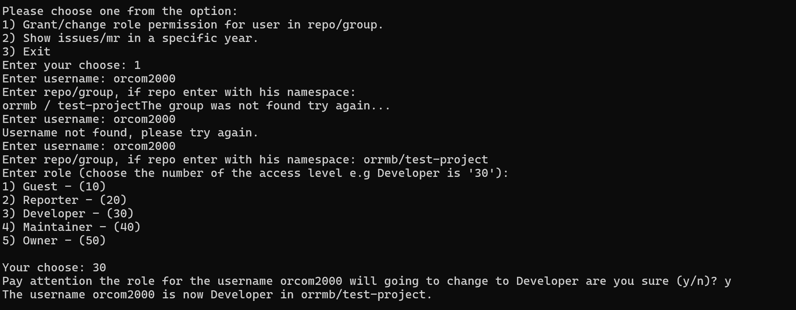
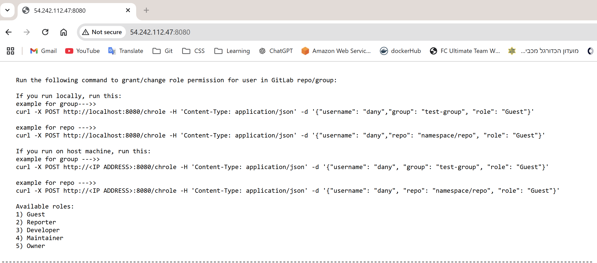

## Mobielye Home Assignment

In this project, I completed the home assignment in two different ways:

---

## 1. Interactive Menu

The code can be found in the `/withMenu` directory.

This implementation features an interactive menu that allows users to select different actions from the terminal.

---

## 2. Flask Web Server

The code for the Flask web server can be found in the `/withFlask` directory.

This implementation exposes a web service using Flask. The service handles role management and issue/merge request retrieval via HTTP endpoints.

